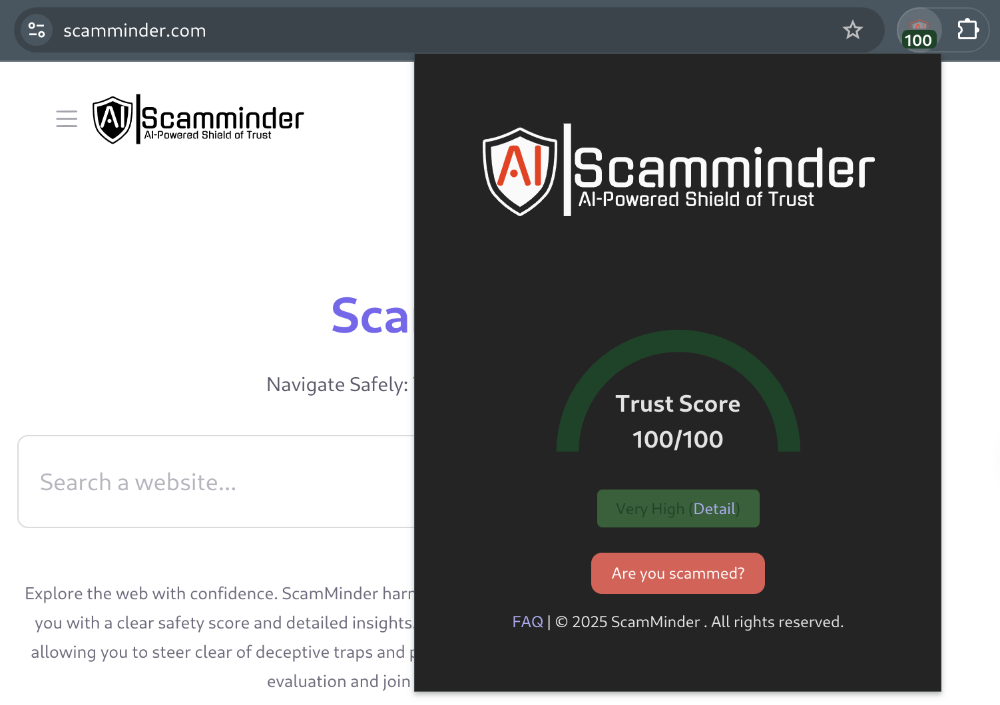

# ScamMinder Browser Extension

ScamMinder is a browser extension that helps users assess the trustworthiness of websites in real-time. It provides instant ratings for visited sites and alerts users about potential scams or fraudulent pages.

## Features

- **Website Trust Rating**: Analyzes and assigns a trust score to websites, alerting users if the site is potentially unsafe.
- **Real-Time Website Analysis**: Automatically checks site credibility based on stored data or fresh analysis.
- **Trust Score Badge**: Displays a badge with a numerical rating and color-coded trust level.
- **Assistance & Reporting**: Offers quick access to help via a "Are you scammed?" button.
- **Background Monitoring**: Evaluates website safety dynamically as users browse.



## Browser Support

ScamMinder currently supports **Google Chrome** due to its use of **Manifest V3 & service workers**. Other browsers may be supported in the future.

## Installation

### **From the Chrome Web Store (Recommended)**
**_The extension is still in testing phase. To see the extension in web store, your email should be whitelisted._**
1. Download the extension from the [Chrome Web Store](https://chromewebstore.google.com/detail/jnnbffmpanofhilgljfooicojfibopgp)
2. Click "Add to Chrome" and confirm installation.
3. The extension icon will appear in your browser toolbar.

### **Manual Installation (Unpacked)**
1. Clone this repository:
   ```bash
   git clone https://github.com/yaim/scamminder-extension.git
   cd scamminder-extension
   ```
2. Install dependencies:
   ```bash
   yarn install
   ```
3. Build the extension:
   ```bash
   yarn build
   ```
   - The unpacked extension will be in `_code_directory/.output/chrome-mv3/`.
4. Load it into Chrome:
   - Open `chrome://extensions/`
   - Enable **Developer Mode** (top right).
   - Click **"Load Unpacked"** and select the output folder.

## Usage

1. Navigate to any website.
2. The extension will display a **trust score** on its icon.
3. Click the extension icon for **detailed insights**.
4. If the website is flagged as suspicious, follow the provided security recommendations.
5. Click **"Are you scammed?"** to access assistance.

## Development

ScamMinder is built on [WXT](https://wxt.dev/) using **Yarn** as the package manager.

To install dependencies:
```bash
yarn install
```

To run a hot reload version:
```bash
yarn dev
```

For more details, please checkout [WXT Guide](https://wxt.dev/guide/introduction.html).

## Contributing

We welcome contributions! Feel free to submit a pull request or report issues.

## License

**License: To Be Determined** (under review).

---

**Developed by ScamMinder Team**

